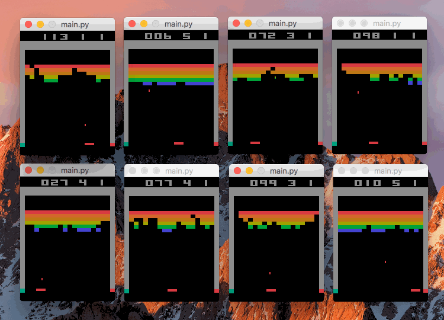

# PPO
PyTorch implementation of Proximal Policy Optimization



## Usage

Example command line usage:
````
python main.py BreakoutNoFrameskip-v0 --num-workers 8 --render
````

This will run PPO with 8 parallel training environments, which will be rendered on the screen. Run with `-h` for usage information.

## References

[Proximal Policy Optimization Algorithms](https://arxiv.org/abs/1707.06347)

[OpenAI Baselines](https://github.com/openai/baselines)
